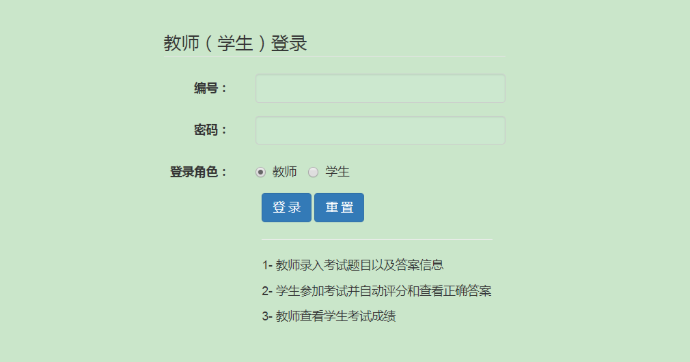
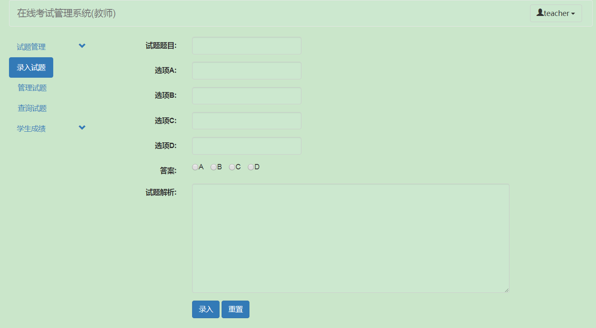
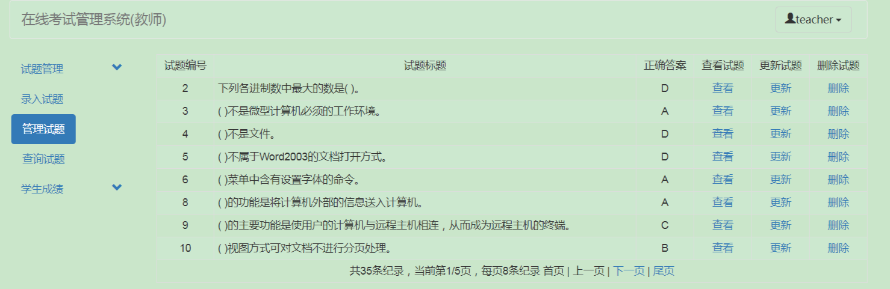
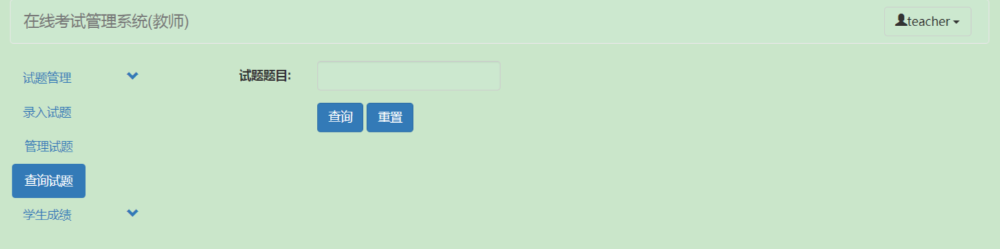
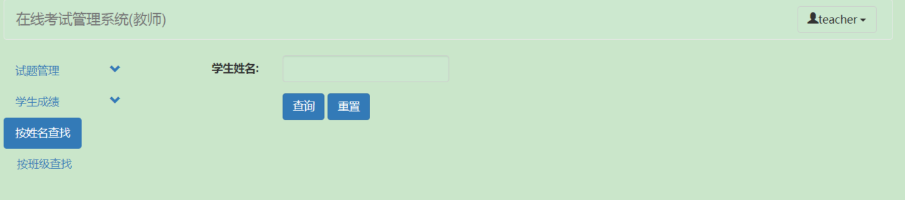
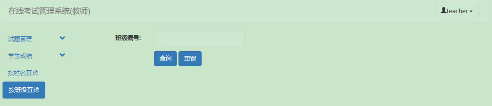
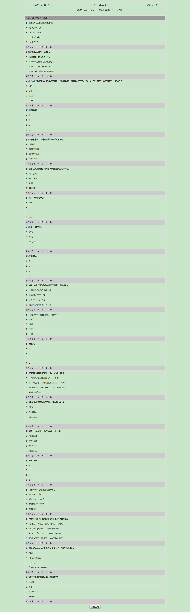
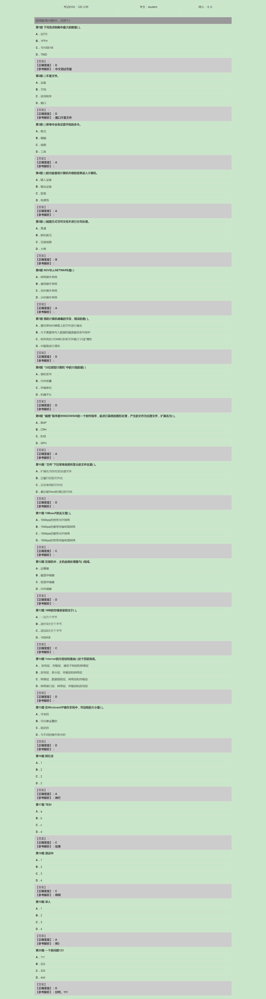

# 简介
这个项目是一个简单的在线考试系统，该练手小项目希望能帮助到大家，熟悉JSP+Servlet。

# 使用技术

数据源：C3P0

前端框架：Bootstrap

# 快速上手
### 1、运行环境和所需工具
* 编译器：IntelliJ IDEA
* 数据库：Mysql
* JDK版本：jdk1.8
* Tomcat版本：Tomcat8.x
### 2、初始化项目
* 在你的Mysql中，导入sql/db_examsystem.sql，执行该脚本，默认创建一个名称为db_examsystem的数据库。
* 打开c3p0-config.xml配置文件，把数据库名称，登录名和密码，改为你本地的。
* 使用 IntelliJ IDEA 直接打开项目。
* 在web/WEB-INF/lib目录右键，add as library。
* 登录账户
  * 教师账户：teacher
  * 密码：teacher

    ​
  * 学生账户：student
  * 密码：student
###3、项目说明
项目的功能按照用户角色划分为两个部分，分别是教师和学生。

​    当用户以教师的角色登录时：可以使用如下功能：
录入试题、试题管理（包括试题更新、删除）、查询试题、按姓名查询（学成成绩）、按班级查询（学生成绩）

​    当用户使用学生角色登录时，会自动开始考试答题（题目是由题库中随机抽取20个），答题结束，用户选择提交，会自动计算得分。用户可以选择查看试题的答案和解析。

### 4、项目功能截图
#### 登录

#### 录入试题

#### 试题管理

#### 查询试题

#### 按姓名查询（考试成绩）

#### 按班级查询（考试成绩）

#### 学生考试

#### 查看试题答案
